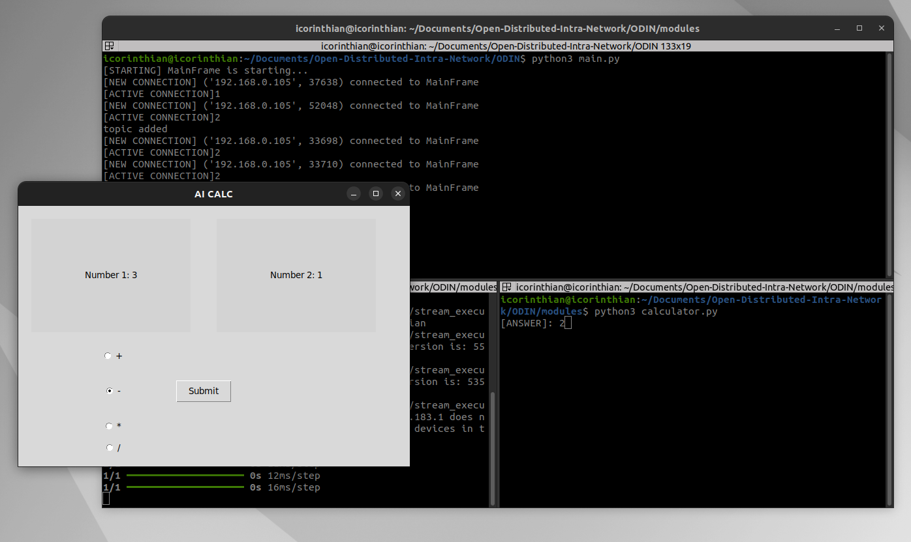

# Open-Distributed-Intra-Network (Project ODIN)

## Introduction

Project ODIN is a groundbreaking distributed real-time system architecture framework built entirely from scratch in Python. It is designed to offer an open and highly customizable platform for a variety of applications, ranging from blockchain to artificial intelligence. ODIN sets itself apart from existing solutions, like ROS (Robot Operating System), by providing greater flexibility and adaptability to meet diverse needs.

## Architecture Overview

The architecture of Project ODIN is composed of three main components:

1. **Mainframe**: The mainframe acts as the central database, maintaining and managing the dataset while the system is running. It ensures data consistency and availability for all connected modules.

2. **Server**: The server layer operates on top of the mainframe, handling the dynamic aspects of data management. It updates, retrieves, and deletes topics published by various modules, facilitating seamless communication and data flow.

3. **Modules**: The modules serve as client applications that interact with the mainframe. They publish and read data, enabling distributed processing and real-time updates. Each module can be tailored for specific tasks, making the system highly versatile.

## Key Features

- **Open and Modifiable**: Unlike ROS, Project ODIN is designed to be more open, allowing extensive modifications to suit different fields such as blockchain and AI.
- **Real-Time Communication**: The framework supports real-time data exchange and processing, crucial for time-sensitive applications.
- **Distributed Architecture**: ODIN’s architecture promotes scalability and fault tolerance, as components can be distributed across multiple nodes.

## Sample Application: AI Calculator

To showcase the capabilities of Project ODIN, an AI calculator application has been developed. This application involves two client nodes that demonstrate how the framework can be used for distributed AI tasks. please reffer to the aicalculator branch for the working code.

### Components

1. **neuralnetwork module**: This module features a neural network that processes images to recognize handwritten numbers. Users drop images into the application, and the neural network predicts the numbers, which are then published to the mainframe.

2. **calculator module**: This module subscribes to the mainframe to receive the recognized numbers. It performs the specified arithmetic operations (addition, subtraction, multiplication, division) on the received numbers and outputs the result.

#### Pros

- **Flexibility**: ODIN’s open design allows for extensive customization and adaptability to various fields.
- **Scalability**: The distributed nature of the framework supports scaling up or down based on requirements.
- **Real-Time Processing**: Ideal for applications needing real-time data exchange and processing.

**preview**
